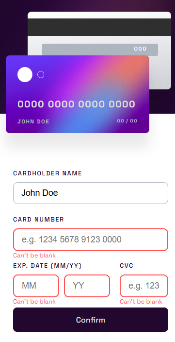

# Interactive Card Details Form

A responsive credit card details form built with HTML, CSS, and JavaScript. The project features real-time updates, form validation, and responsive design for different screen sizes.

## 📸 Preview

## 🚀 Live Demo

**Live Site:** https://kevsz34.github.io/Interactive-Card/

## ✨ Features

* Responsive layout for mobile and desktop devices.
* Real-time credit card preview.
* Form validation.
* Automatic card number formatting.
* Error handling with visual feedback.
* Basic accessibility improvements.
* Clean and organized JavaScript structure.

## 🛠️ Built With

* HTML5
* CSS3
* JavaScript (Vanilla JS)

## 📚 What I Learned

During this project, I practiced:

* DOM manipulation.
* Form validation.
* Input formatting.
* Responsive design.
* Accessibility basics using ARIA attributes.
* JavaScript code organization and maintainability.

## 🎯 Challenges

Some interesting challenges included:

* Formatting the card number dynamically.
* Keeping the card preview synchronized with user input.
* Handling validation and error states.
* Improving accessibility for form interactions.

## 🔧 Future Improvements

* More advanced validation rules.
* Additional accessibility enhancements.
* Smoother animations and transitions.
* Further code refactoring and optimization.

## 👨‍💻 Author

GitHub: https://github.com/kevsz34

Frontend Mentor: https://www.frontendmentor.io/profile/kevsz34
